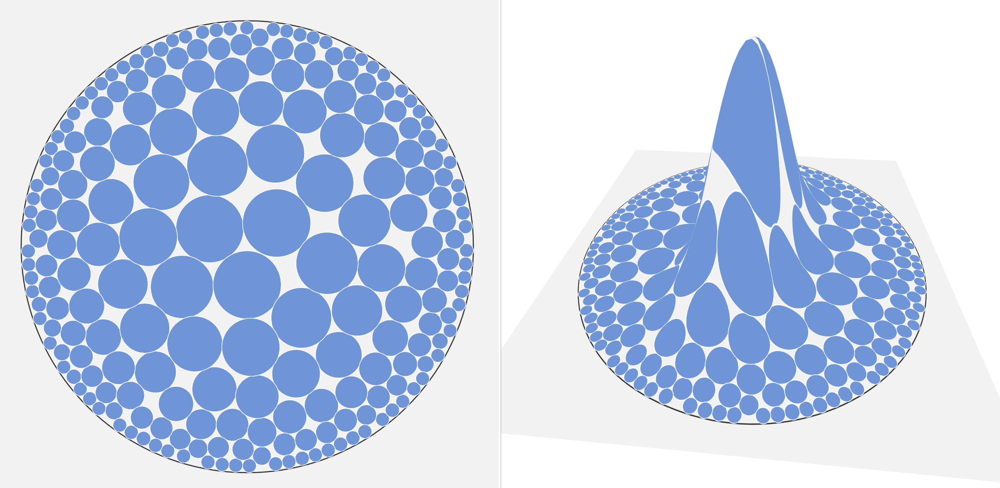

## [Link to interactive page here](https://whatisthisname.github.io/non-euclidean-circle-packing/)

#### I am using the `Rapier2D 🦀` physics engine to approximately get good circle packings in a local-coordinate system representation of a 2D Manifold.

### Screenshots from varying stages of development:

